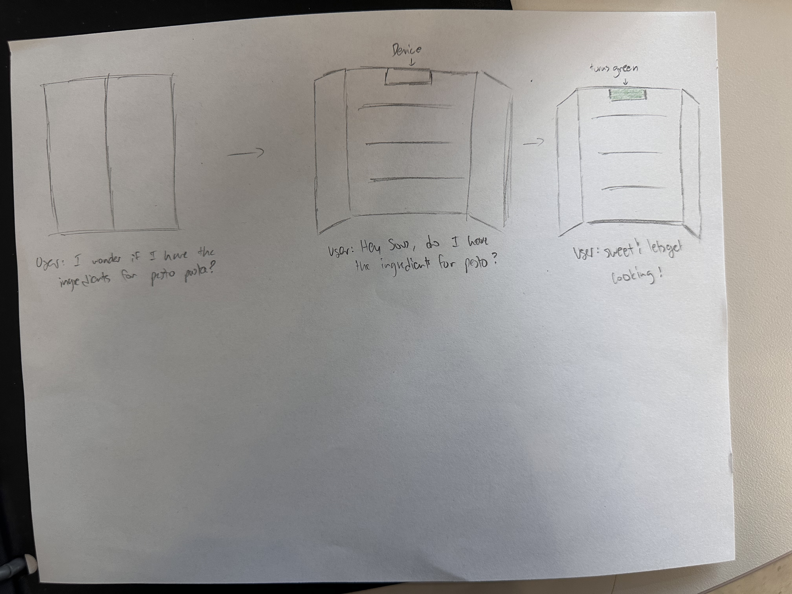
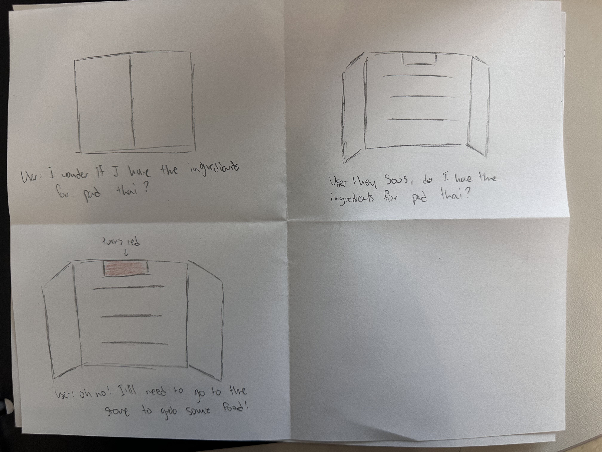
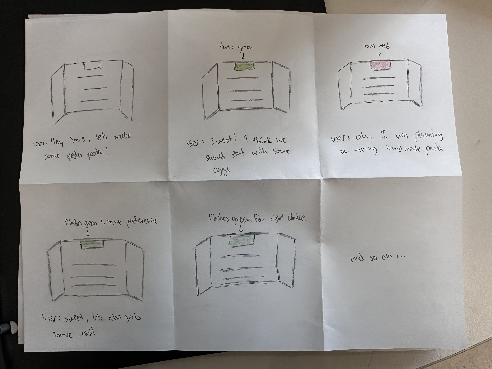
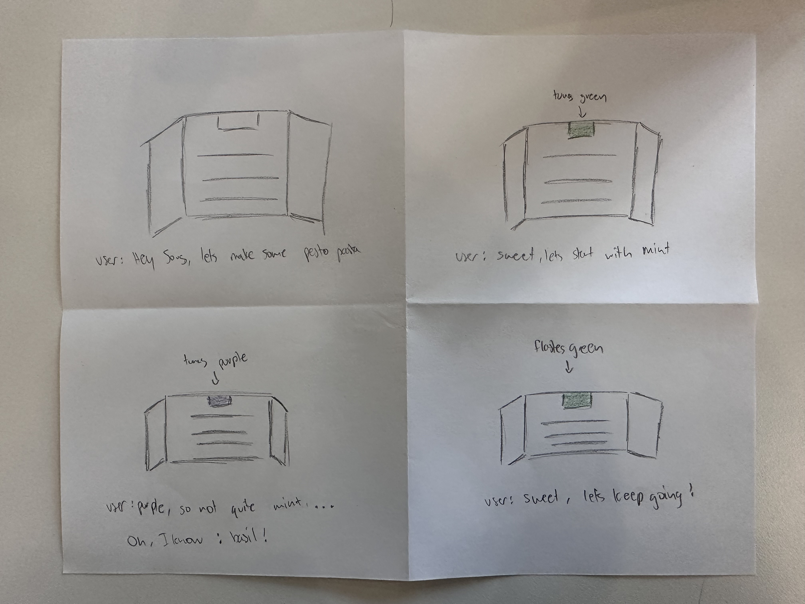
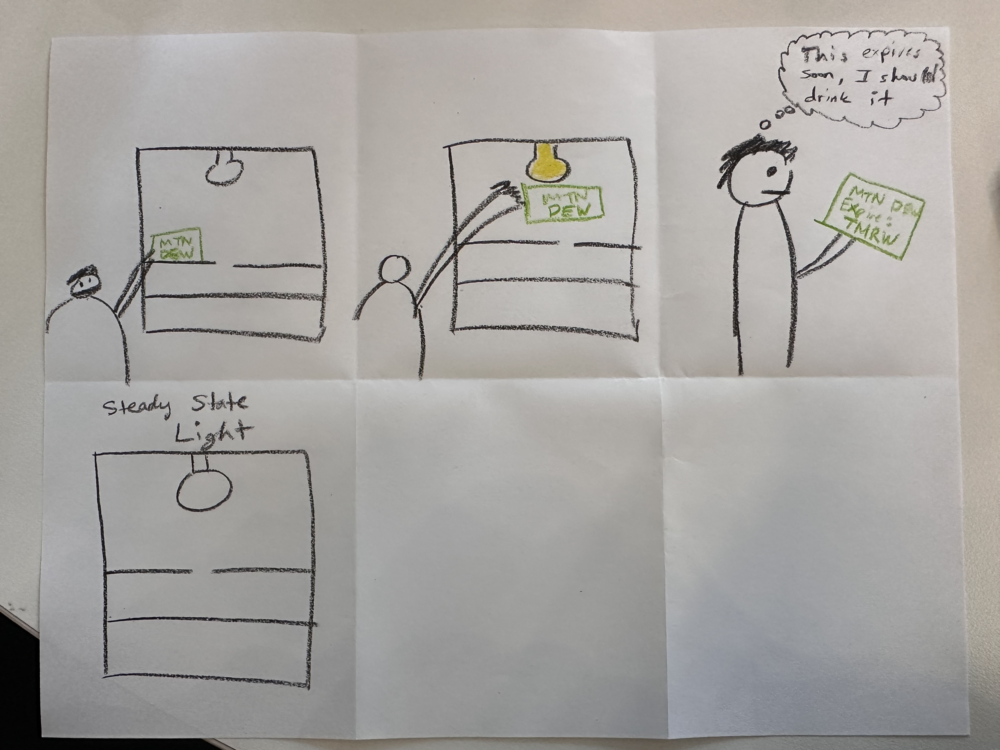
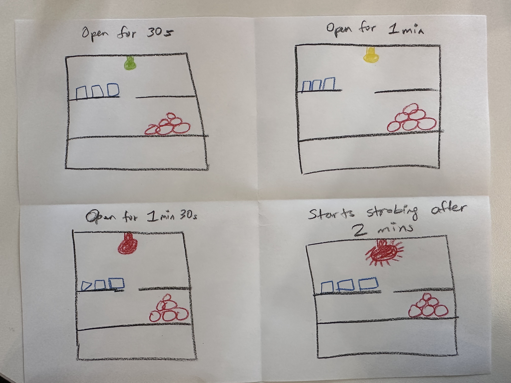
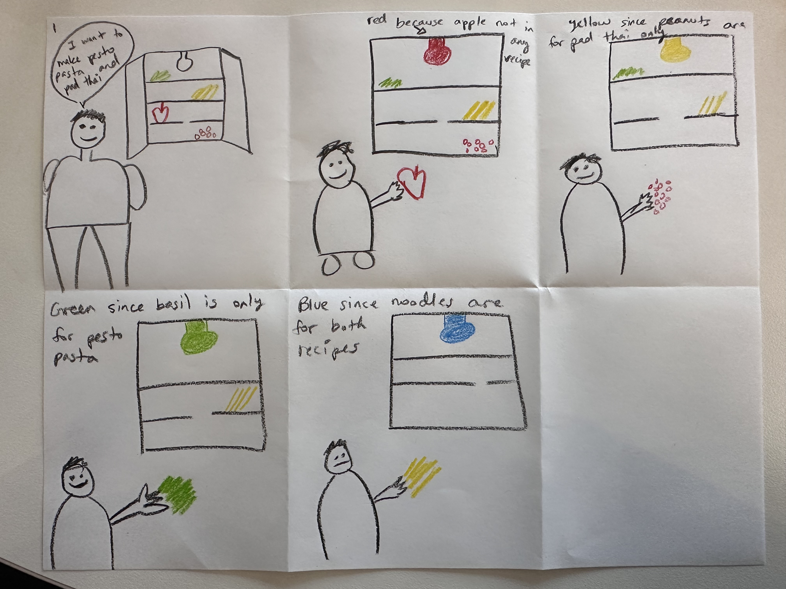
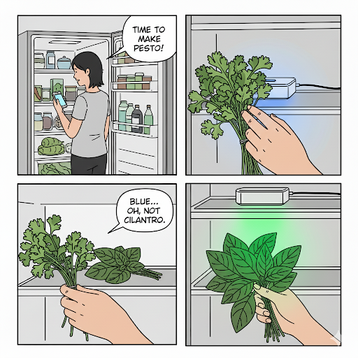

# Staging Interaction

\*\***Sachin Jojode**\*\*

In the original stage production of Peter Pan, Tinker Bell was represented by a darting light created by a small handheld mirror off-stage, reflecting a little circle of light from a powerful lamp. Tinkerbell communicates her presence through this light to the other characters. See more info [here](https://en.wikipedia.org/wiki/Tinker_Bell). 

There is no actor that plays Tinkerbell--her existence in the play comes from the interactions that the other characters have with her.

For lab this week, we draw on this and other inspirations from theatre to stage interactions with a device where the main mode of display/output for the interactive device you are designing is lighting. You will plot the interaction with a storyboard, and use your computer and a smartphone to experiment with what the interactions will look and feel like. 

_Make sure you read all the instructions and understand the whole of the laboratory activity before starting!_

## Prep

### To start the semester, you will need:
1. Read about Git [here](https://git-scm.com/book/en/v2/Getting-Started-What-is-Git%3F).
2. Set up your own Github "Lab Hub" repository by forking the [Interactive-Lab-Hub repository](https://github.com/FAR-Lab/Interactive-Lab-Hub). To get lab updates, simply [use GitHub's "Sync fork" button when new content is available](https://docs.github.com/en/pull-requests/collaborating-with-pull-requests/working-with-forks/syncing-a-fork).

3. Set up the README.md for your Hub repository (for instance, so that it has your name and points to your own Lab 1). You can [learn how to organize and format your README.md here](https://docs.github.com/en/get-started/writing-on-github/getting-started-with-writing-and-formatting-on-github/basic-writing-and-formatting-syntax). Make sure to include links to your submissions so they are easy to find.

### For this lab, you will need:
1. Paper
2. Markers/ Pens
3. Scissors
4. Smart Phone -- The main required feature is that the phone needs to have a browser and display a webpage.
5. Computer -- We will use your computer to host a webpage which also features controls.
6. Found objects and materials -- You will have to costume your phone so that it looks like some other devices. These materials can include doll clothes, a paper lantern, a bottle, human clothes, a pillow case, etc. Be creative!

### Deliverables for this lab are: 
1. 7 Storyboards
1. 3 Sketches/photos of costumed devices
1. Any reflections you have on the process
1. Video sketch of 3 prototyped interactions
1. Submit the items above in the lab1 folder of your class [Github page], either as links or uploaded files. Each group member should post their own copy of the work to their own Lab Hub, even if some of the work is the same from each person in the group.

### The Report
This README.md page in your own repository should be edited to include the work you have done (the deliverables mentioned above). Following the format below, you can delete everything but the headers and the sections between the **stars**. Write the answers to the questions under the starred sentences. Include any material that explains what you did in this lab hub folder, and link it in your README.md for the lab.

## Lab Overview
For this assignment, you are going to:

A) [Plan](#part-a-plan) 

B) [Act out the interaction](#part-b-act-out-the-interaction) 

C) [Prototype the device](#part-c-prototype-the-device)

D) [Wizard the device](#part-d-wizard-the-device) 

E) [Costume the device](#part-e-costume-the-device)

F) [Record the interaction](#part-f-record)

Labs are due on Mondays. Make sure this page is linked to on your main class hub page.

## Part A. Plan 

To stage an interaction with your interactive device, think about:

_Setting:_ Where is this interaction happening? (e.g., a jungle, the kitchen) When is it happening?

_Players:_ Who is involved in the interaction? Who else is there? If you reflect on the design of current day interactive devices like the Amazon Alexa, it’s clear they didn’t take into account people who had roommates, or the presence of children. Think through all the people who are in the setting.

_Activity:_ What is happening between the actors?

_Goals:_ What are the goals of each player? (e.g., jumping to a tree, opening the fridge). 

The interactive device can be anything *except* a computer, a tablet computer or a smart phone, but the main way it interacts needs to be using light.

\*\***Describe your setting, players, activity and goals here.**\*\*

**The goal of our interactive device is to act as "Duolingo for cooking". I am working on this together with Sachin Jojode as I have mentioned above, and we have heavily constrained our solution to only use light as a medium for communication. The setting we came up with was in an every day fridge, a helpful assistant I can guide you and turn you into a better home chef. Imagine a light box that sits at the top of your fridge and has knowledge of what else exists inside your fridge in pantry. You can ask me questions like: "do I have enough ingredients for pesto pasta"; and it not only answer that question, but can also guide you as you gather ingredients to prepare the dish. In this case, the players would be anyone interested in cooking something at home and we intend for this device to be used primarily with one or a small group of people. The primary activity here is to both gather the right ingredients to prepare a dish as well as to build the users intuition as a chef.**

**Please note that no AI tools were used to conceive this idea, the only automated tool was using voice to text to "type" out this paragraph.**

Storyboards are a tool for visually exploring a users interaction with a device. They are a fast and cheap method to understand user flow, and iterate on a design before attempting to build on it. Take some time to read through this explanation of [storyboarding in UX design](https://www.smashingmagazine.com/2017/10/storyboarding-ux-design/). Sketch seven storyboards of the interactions you are planning. **It does not need to be perfect**, but must get across the behavior of the interactive device and the other characters in the scene. 

\*\***Include pictures of your storyboards here**\*\*

**Please note that our group used AI tools while brainstorming different interactions that users may have with the device. Also, AI tools were used to generate some early drafts of storyboards like the one shown below (which was created using Gemini):** 

Present your ideas to the other people in your breakout room (or in small groups). You can just get feedback from one another or you can work together on the other parts of the lab.

\*\***Summarize feedback you got here.**\*\*

**Here is a summarized list of feedback we gathered from others. We also had a chance to gather some feedback from other friends on campus:**

* The product should include voice / other communicatory techniques to make the device **more accessible to people with disabilities like color blindness**. 
* The product should be able to communicate a slightly **incomplete set of ingredients** - both for purchasing and for deciding if the current set is acceptable to still cook with. 
* The product should have the **ability to guide impromptu recipes**, not just ones from a pre-created list.
* The product should also have **global knowledge of a user's kitchen** (pantry, utensils, cooktops, etc.).
* The product could also help the user **optimize how they store their ingredients** to maximize space and proper placement. 
* The product can help the user **plan meals** (when to thaw ingredients, creating recipes that best balance remaining ingredients, etc.). 

**Please note that no AI tools were used when aggregating this feedback.**

## Part B. Act out the Interaction

Try physically acting out the interaction you planned. For now, you can just pretend the device is doing the things you’ve scripted for it. 

\*\***Are there things that seemed better on paper than acted out?**\*\*

* Talking to the device is a bit awkward. It feels like the first days of talking to Siri or Alexa, but we assume this will become more confortable over time.
* The "action words" will also take some time getting used to; however in practice, we assume that an NLP pipeline will be used to make the interactions more natural.
* We initially assumed the device would just be mounted on the top of the fridge area, but then tried interacting with the device in multiple fridge types (at both my dorm and Sachin's house) and realized that the "static" viewpoint made seing the light uncomfortable if the fridge was too low (in configurations where the freezer is on top). 
* Regardless of the position, however, there is the feeling of always needing to "look back at the device" to see its response. The best analogy to this is trying to use "vanilla ChatGPT" for code where you need to constantly switch between your editor and the chat window. Instead, something like "cursor" where the device doesn't distract the user from the task of cooking seems like the more natural solution. However, we concede that this is a function of the device being singular and only communicating through light. 

\*\***Are there new ideas that occur to you or your collaborator that come up from the acting?**\*\*

* Yes, specifically about the positioning of the device. We had a lot of fun with this and tried many different positions for where the device should be mounted. Primarily, we realized that the best way to do this would be to have a flat side of the device so the user can choose where to place it. 
* We also realized that the device could be a multi-device network, so that one instance can be in the fridge, another in the pantry, freezer, on top of the island or stove, etc.
* We think it would be very useful for the device to be able to communicate more nuanced information. For example, different colors could indicate the "correctness" of a user prompt (an example being if the user asks "do you think ketchup would work with pesto", where there isn't a clear answer and it's based on what the device thinks the user's preferences are).

**Please note that no AI tools were used when acting out the interaction or noting down improvements / pain points.**

## Part C. Prototype the device

You will be using your smartphone as a stand-in for the device you are prototyping. You will use the browser of your smart phone to act as a “light” and use a remote control interface to remotely change the light on that device. 

Code for the "Tinkerbelle" tool, and instructions for setting up the server and your phone are [here](https://github.com/IRL-CT/tinkerbelle).

We invented this tool for this lab! 

If you run into technical issues with this tool, you can also use a light switch, dimmer, etc. that you can can manually or remotely control.

\*\***Give us feedback on Tinkerbelle.**\*\*

## Part D. Wizard the device
Take a little time to set up the wizarding set-up that allows for someone to remotely control the device while someone acts with it. Hint: You can use Zoom to record videos, and you can pin someone’s video feed if that is the scene which you want to record. 

\*\***Include your first attempts at recording the set-up video here.**\*\*

Now, hange the goal within the same setting, and update the interaction with the paper prototype. 

\*\***Show the follow-up work here.**\*\*

## Part E. Costume the device

Only now should you start worrying about what the device should look like. Develop three costumes so that you can use your phone as this device.

Think about the setting of the device: is the environment a place where the device could overheat? Is water a danger? Does it need to have bright colors in an emergency setting?

\*\***Include sketches of what your devices might look like here.**\*\*

\*\***What concerns or opportunitities are influencing the way you've designed the device to look?**\*\*

## Part F. Record

\*\***Take a video of your prototyped interaction.**\*\*

\*\***Please indicate who you collaborated with on this Lab.**\*\*
Be generous in acknowledging their contributions! And also recognizing any other influences (e.g. from YouTube, Github, Twitter) that informed your design. 

# Staging Interaction, Part 2 

This describes the second week's work for this lab activity.

## Prep (to be done before Lab on Wednesday)

You will be assigned three partners from other groups. Go to their github pages, view their videos, and provide them with reactions, suggestions & feedback: explain to them what you saw happening in their video. Guess the scene and the goals of the character. Ask them about anything that wasn’t clear. 

\*\***Summarize feedback from your partners here.**\*\*

## Make it your own

Do last week’s assignment again, but this time: 
1) It doesn’t have to (just) use light, 
2) You can use any modality (e.g., vibration, sound) to prototype the behaviors! Again, be creative! Feel free to fork and modify the tinkerbell code! 
3) We will be grading with an emphasis on creativity. 

\*\***Document everything here. (Particularly, we would like to see the storyboard and video, although photos of the prototype are also great.)**\*\*
