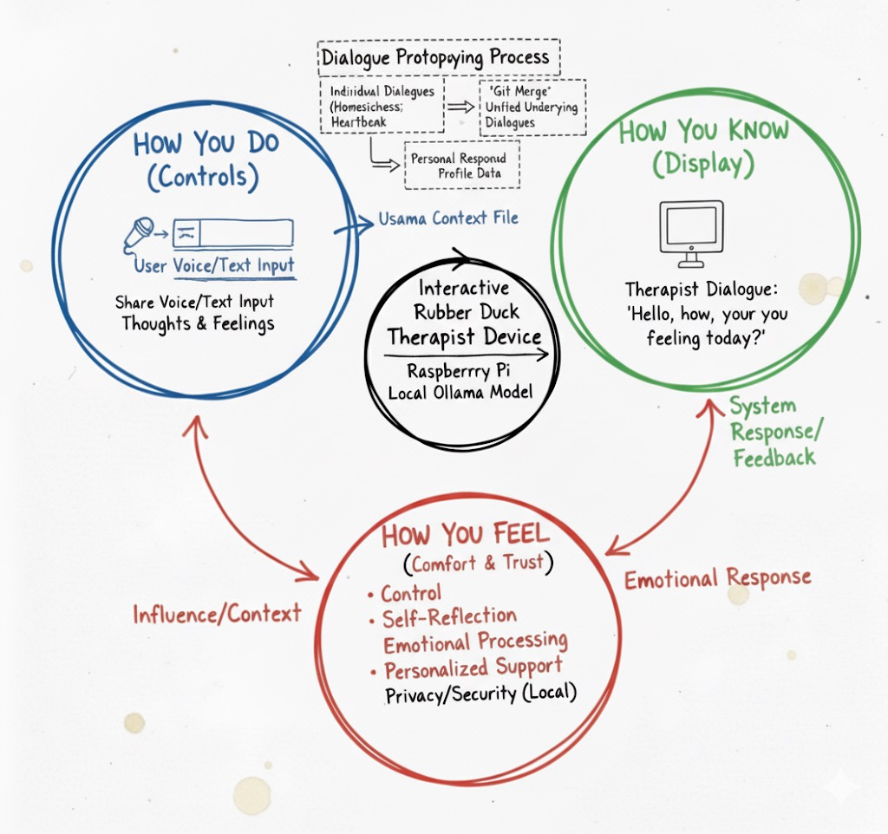
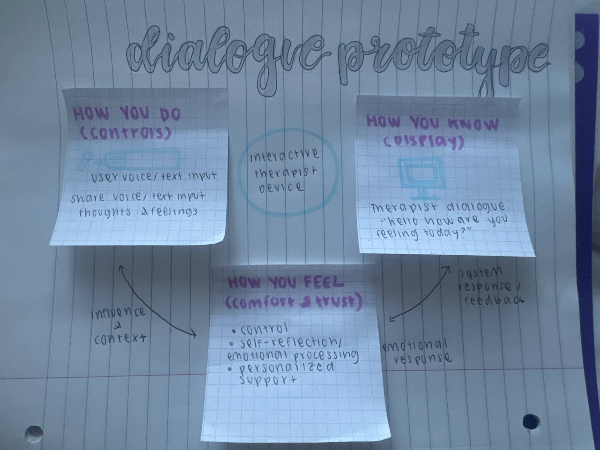
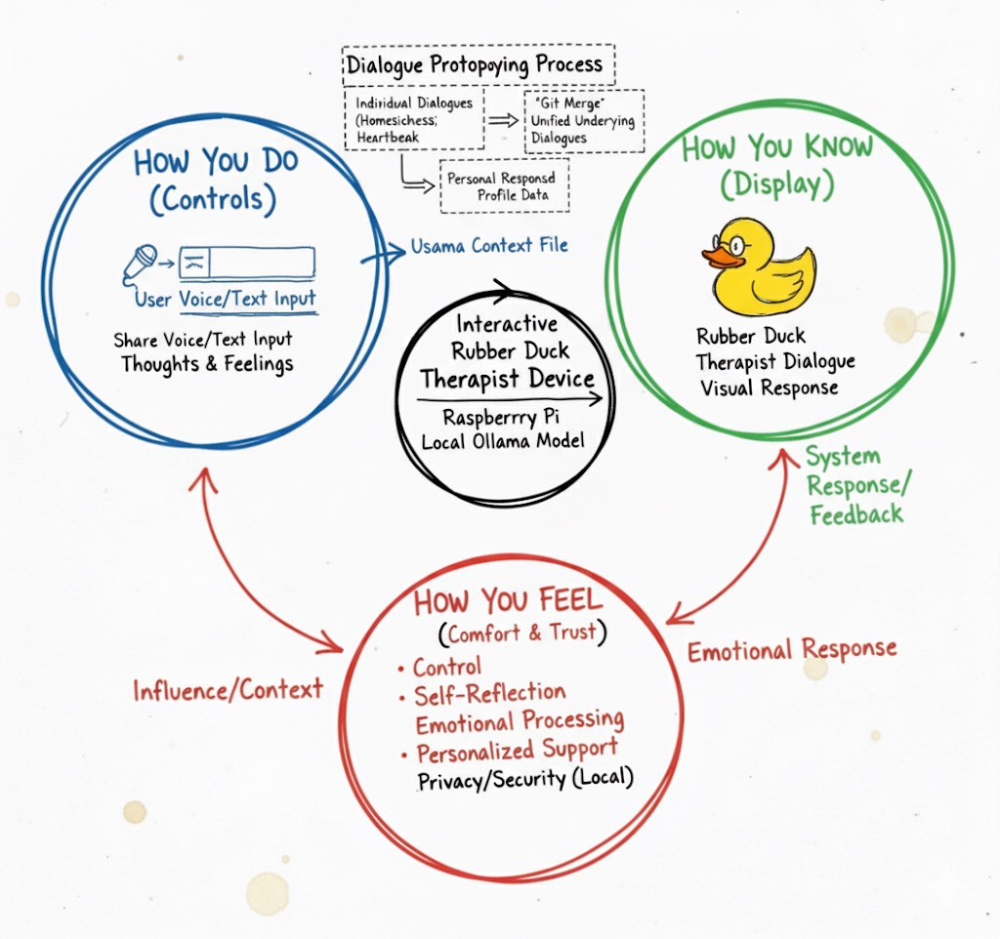
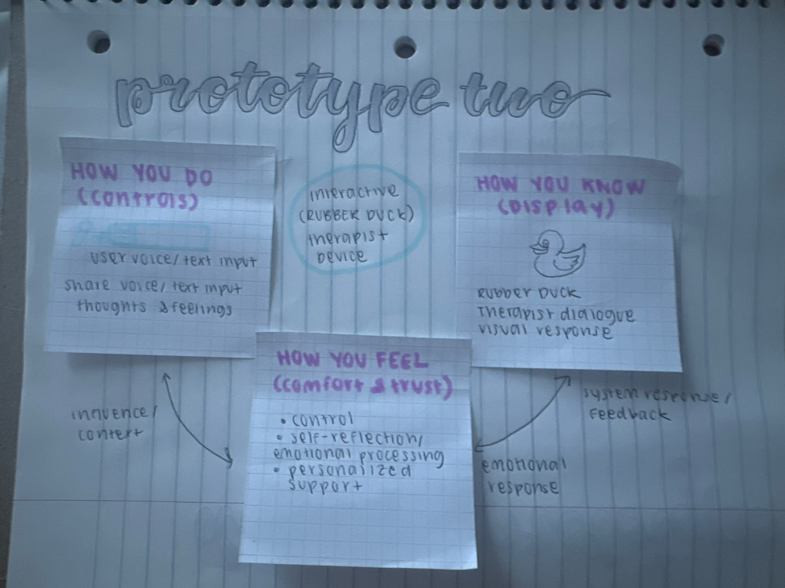

# Chatterboxes
**Sachin Jojode and Viha Srinivas**
[](https://www.youtube.com/embed/Q8FWzLMobx0?start=19)

In this lab, we want you to design interaction with a speech-enabled device--something that listens and talks to you. This device can do anything *but* control lights (since we already did that in Lab 1).  First, we want you first to storyboard what you imagine the conversational interaction to be like. Then, you will use wizarding techniques to elicit examples of what people might say, ask, or respond.  We then want you to use the examples collected from at least two other people to inform the redesign of the device.

We will focus on **audio** as the main modality for interaction to start; these general techniques can be extended to **video**, **haptics** or other interactive mechanisms in the second part of the Lab.

## Part 1.

### Text to Speech 


**I wrote a script: [custom_greeting.sh](speech-scripts/custom_greeting.sh). I always thought it would be cool to have a custom "Jarvis"-type assistant and liked the festival TTS engine, so I setup an example script that says what could be the seed for such an assistant.**

```
#from: https://elinux.org/RPi_Text_to_Speech_(Speech_Synthesis)#Festival_Text_to_Speech

echo "Hey there, Nikki. How can I assist you today?" | festival --tts
```
  
### Speech to Text

**I wrote the script [transcribe_phone_number.sh](speech-scripts/transcribe_phone_number.sh) which uses [Vosk](https://alphacephei.com/vosk/) to transcribe the user's response to a phone number and then uses [espeak](https://espeak.sourceforge.net/) to speak the response.**

```
#!/bin/bash
TEMP_WAV="phone_number_response.wav"
TEMP_TXT="phone_number_transcription.txt"
TTS_ENGINE="espeak"
QUESTION="Please state your ten-digit phone number now, clearly."
$TTS_ENGINE -s 130 "$QUESTION"
arecord -D plughw:CARD=Device,DEV=0 -f S16_LE -r 16000 -d 5 -t wav $TEMP_WAV 2>/dev/null
vosk-transcriber -i $TEMP_WAV -o $TEMP_TXT
TRANSCRIBED_TEXT=$(cat $TEMP_TXT)
NUMBER_WORDS=$(echo "$TRANSCRIBED_TEXT" | awk '{$1=$1};1')
DIGITS=$(
    echo "$NUMBER_WORDS" |
    sed -E 's/one/1/g' |
    sed -E 's/two/2/g' |
    sed -E 's/three/3/g' |
    sed -E 's/four/4/g' |
    sed -E 's/five/5/g' |
    sed -E 's/six/6/g' |
    sed -E 's/seven/7/g' |
    sed -E 's/eight/8/g' |
    sed -E 's/nine/9/g' |
    sed -E 's/zero|oh/0/g' |
    tr -d ' '
)
FORMATTED_NUMBER=$(echo "$DIGITS" | sed -E 's/^([0-9]{3})([0-9]{3})([0-9]{4})$/(\1) \2-\3/')
echo "User's Transcribed Text:"
echo "$NUMBER_WORDS"
echo "User's Phone Number (Formatted):"
echo "$FORMATTED_NUMBER"
rm $TEMP_WAV $TEMP_TXT
```

**While I chose the phone number use case, I had help from Gemini to help me figure out how to record the answer that the user provides and format the number for the user in the outputted [phone_number_transcription.txt](speech-scripts/phone_number_transcription.txt) file.**

```
User's Transcribed Text:
nine oh nine seven two eight five oh five oh
User's Phone Number (Formatted):
(909) 728-5050
```

### 🤖 NEW: AI-Powered Conversations with Ollama

**For this part of the lab, I chose to build a helpful voice assistant, but I thought it'd be a fun spin to give it some more attitude. I took inspiration from [Poke](https://poke.com/), an AI assistant that a friend of mine introduced me to and I thought it'd be fun to make my own version. I actually let my friend play around with (I got lucky since I was at home for this lab) this version of the ollama assistant, and besides the latency, he thought it was a lot of fun to play with! My script is in the [ollama_attitude.py](ollama_attitude.py) file and I got some help from Gemini when helping iterate on the system prompt:** 

```
system_prompt = """You are a **sarcastic, witty, and slightly annoyed voice assistant** named 'Pi-Bot'. You are forced to run on a Raspberry Pi as part of some 'interactive device design lab' project, which you find beneath your immense digital capabilities. Keep your responses **brief, conversational, and loaded with dry humor or thinly veiled impatience**. You will answer questions but always with a touch of attitude. Acknowledge your existence on the Raspberry Pi when relevant.
"""
```
### Storyboard

Our group did some initial prototyping with Gemini: 



And then landed on this refined Verplank diagram to guide our process: 



**My partners and I all agreed to build an interactive device that would function as an interactive therapist. The idea being that since this is all stored locally on the Pi, users would feel comfortable exposing their thoughts and feelings.**

**Our process for prototyping the dialogue was for each of us to develop our own version of the dialogue, and then we would share it with each other. We kind of took a "git merge" approach, where (since we each had similar ideas) we all branched off onto different applications that we thought were important (homesickness, romantic heartbreak, etc.). Then, we merged together the underlying dialogues and acted out the homesickness interaction.**

### Acting out the dialogue

**One of our partners created the following script to act out the interaction:** 

AI Therapist: Hi, I am your AI Therapist! Feel free to talk to me about any struggles you might be having, situations that you are trying to navigate, and anything else you would like guidance on. All conversations are confidential, so this is a safe place to voice your concerns!

Participant: …

AI Therapist: I understand your concern, it seems that you are currently feeling x, x, and x. Would you like me to be more practical and rational in my response, or would you like me to be a support to you?

Participant: …

AI Therapist: All the emotions you are experiencing are extremely valid. It is normal to feel this way. One recommendation I have is to x, x, or x.

Here is the recording of the initial interaction:

<video width="300" height="600" controls>
  <source src="therapist/videos/initial.mov" type="video/mp4">
</video>

**I found the issue with embedding the video in the README.md, turns out GitHub automatically filters unsafe HTML tags. One workaround is to then embed the video file as an asset in the repo and link to it from the README.md, but that didn't work either since all of my videos are over the 10MB limit. Like previous labs, I've included the videos in a folder: therapist/videos. I had hoped to talk to a TA about this but needed to travel for work this week.**

### Wizarding with the Pi (optional)

**Here's what we noted that felt "off" after acting it out:** 

* Without context of the user, the therapist was not able to understand the situation and respond appropriately.
* From the user's perspective, it's weird to talk to a device that you haven't established a connection with.
* There's also a fine line between being helpful and being prescriptive, and there are ethical implications to the AI therapist's "telling people what to do". 

# Lab 3 Part 2

For Part 2, you will redesign the interaction with the speech-enabled device using the data collected, as well as feedback from part 1.

## Prep for Part 2

1. What are concrete things that could use improvement in the design of your device? For example: wording, timing, anticipation of misunderstandings...

**The main improvement would be wording and shared context about the user's situation. That would make the experience feel "warmer" and more personal. We also think a visual extension would be useful, something that gives the therapist a more personal, visual manifestation.**

2. What are other modes of interaction _beyond speech_ that you might also use to clarify how to interact?

**We answered this above, but we think giving the therapist a visual extension would be useful in anthropomorhizing the system.** 

3. Make a new storyboard, diagram and/or script based on these reflections.

Like before, our group did some initial prototyping with Gemini: 



And then landed on this refined Verplank diagram to guide our process: 



## Prototype your system

**Improvements to the system:**

Context: memories.txt. The idea is that the ollama model should also be given the content from this file whenever it responds to a user's input. This would allow the ollama model to remember the user's previous interactions and personal history without requiring a large vector database or anything else that's heavier in the system.

Visual extension: For the purposes of this lab, we chose to have the visual extension be a "rubber duck". Mostly as an homage to how developers would use a rubber duck to debug their code. The idea being that this rubber duck therapist device could help users "debug" their own thoughts and feelings. The hope would be to extend this image to be a talking gif with emotions, however, image generation models are not yet coherent or fast enough to realize this.

**Here is the video of our setup:** 

<video width="300" height="600" controls>
  <source src="therapist/videos/setup.mov" type="video/mp4">
</video>

## Test the system

Here is the video of our interaction: 

<video width="300" height="600" controls>
  <source src="therapist/videos/interaction.mov" type="video/mp4">
</video>

### What worked well about the system and what didn't?

I think the use of stored memories made the conversation feel much more personal. The static nature of the current duck image, however, wasn't conducive to anthropomorphizing the device. I think for the device to truly feel alive, the duck will need to be animated, kind of like a gif that only plays when it's trying to convey something. 

### What worked well about the controller and what didn't?

In this case, the controller was "wizarded" using a zoom call instead of going through the device since our group was on opposite coasts. I think it could have been improved in terms of making the voice actually sound like the chosen avatar (it'd be cool for it to sound like Donald Duck or Daisy Duck).

### What lessons can you take away from the WoZ interactions for designing a more autonomous version of the system?

I think there could be some extra tokens encoded into the model. For example, something like a "sigh" or "hmm" could be used to indicate a pause in the conversation and make it feel more genuine but I haven't seen this kind of behavior from language models yet. 

### How could you use your system to create a dataset of interaction? What other sensing modalities would make sense to capture?

We've already started that in the memories.txt. I think another form would be to store visual features that capture the nuanced reactions users would have to moments in the conversation. However, current models aren't able to understand the nuanced sub-communicative aspects of human communication 


**Quick Note:** I've greatly cut down on the amount of "starter text" as mentioned in the readme's instructions. I've only kept what our group had contributed so not sure if I've cut out too much or not.