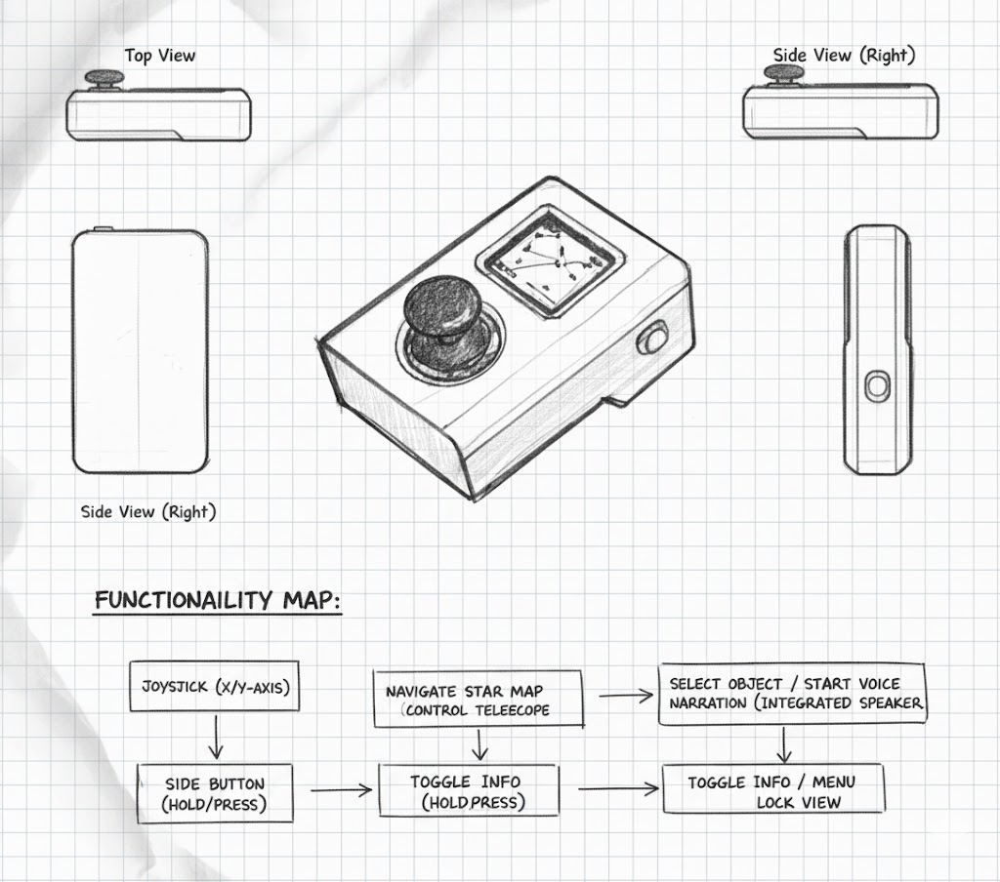
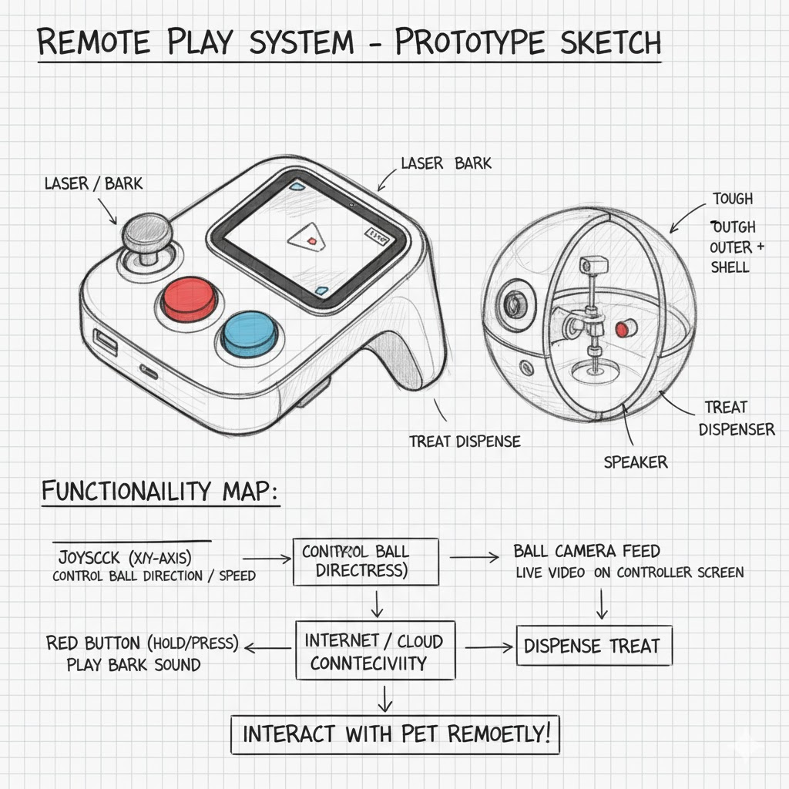
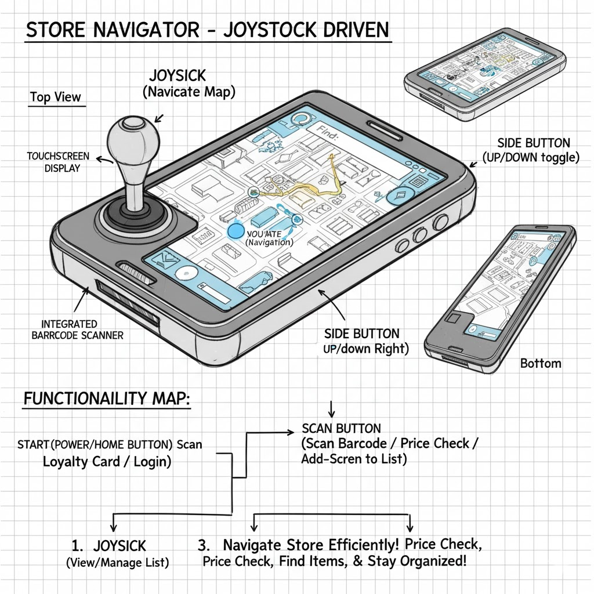

# Ph-UI!!!

Collaborators: Sachin Jojode, Viha Srinivas, Arya Prasad

## Part A
### Capacitive Sensing, a.k.a. Human-Twizzler Interaction 

For all sensor testing videos, you can view them in the **Lab 4/assets/videos/sensor_tests** folder. Apologies for the lack of rendering on the GitHub side but they are rendering properly when in VSCode.

Video link: [twizzler.mov](assets/videos/sensor_tests/twizzler.mov)

<video width="300" height="600" controls>
  <source src="assets/videos/sensor_tests/twizzler.mov" type="video/mp4">
</video>

### Part B

#### Light/Proximity/Gesture sensor (APDS-9960)

Video link: [color_proximity.mov](assets/videos/sensor_tests/color_proximity.mov)

<video width="300" height="600" controls>
  <source src="assets/videos/sensor_tests/color_proximity.mov" type="video/mp4">
</video>

Video link: [color_test.mov](assets/videos/sensor_tests/color_test.mov)
<video width="300" height="600" controls>
  <source src="assets/videos/sensor_tests/color_test.mov" type="video/mp4">
</video>

Video link: [gesture_test.mov](assets/videos/sensor_tests/gesture_test.mov)
<video width="300" height="600" controls>
  <source src="assets/videos/sensor_tests/gesture_test.mov" type="video/mp4">
</video>

#### Rotary Encoder 

Video link: [encoder.mov](assets/videos/sensor_tests/encoder.mov)
<video width="300" height="600" controls>
  <source src="assets/videos/sensor_tests/encoder.mov" type="video/mp4">
</video>

#### Joystick 

Video link: [joystick.mov](assets/videos/sensor_tests/joystick.mov)
<video width="300" height="600" controls>
  <source src="assets/videos/sensor_tests/joystick.mov" type="video/mp4">
</video>

#### Distance Sensor

Video link: [proximity.mov](assets/videos/sensor_tests/proximity.mov)
<video width="300" height="600" controls>
  <source src="assets/videos/sensor_tests/proximity.mov" type="video/mp4">
</video>

### Part C
### Physical considerations for sensing

This is the AstroClicker, the idea is to have a device that helps you navigate the night sky. It uses the joystick as the primary input where the user can select what they're looking at and how far or close away to look.



Our next idea was the city Explorer, the idea is to have a device that helps you explore a new city and even find some hidden gems in the city you've been in for a while. These is the joystick that the user can use to select the next place to go, and the device will keep track of where you've been.


Our next idea was remote play, the idea is to have a device that allows you to remotely play with your pet. It's a combination of both a joystick input as well as a gyroscopic ball that moves around at the user command.



Our next idea was flashcards, we were inspired by devices like [Anki](https://www.ankiremote.com/) that help users learn a subject through flashcards. This was our spin on the device that allows the user to input through joystick instead of just buttons.


Our last idea was store navigator, the idea is to have a device that helps you navigate the labyrinth of aisles that are present in most grocery stores. The device will come preloaded with a map of whatever store you're in, and the user can navigate to an aisle and see if the item they're attempting to purchase is actually available.



Some questions that these sketches raise are:
* How can we integrate other interesting modalities besides a display that we can use interact with the user?
* How can we make this device more ergonomic?
* How can we make this device more accessible for those with disabilities?
* How can we design the user experience to have the device be easy to use well also not too hand-holdy?

We've chosen to continute working on the AstroClicker!!! 

### Part D
 
These were the different designs we came up with for the AstroClicker:


Here is some of the rationale for our initial design (which we based off of Prototype 1):
* The device will be handheld, and so the joystick should be placed in ergonomic position.
* The speaker should be facing at the user since otherwise, sound will appear to be muffled.
* The raspberry pi should have enough ventilation as to not overheat and there should be space for a battery

Build a cardboard prototype of your design. You will see that we've integrated a lot of our initial rationale behind our initial design as we do the walk-through. The placeholder, for the battery was an alto scan, and the top cut out is for ventilation for the raspberry pi.

Here is a video walk-around of the AstroClicker prototype. If this video is not rendering properly, you can view it in the **assets/videos** folder for the mov called **walk_around.mov**.

<video width="300" height="600" controls>
  <source src="assets/videos/walk_around.mov" type="video/mp4">
</video>

# LAB PART 2

### Part 2

Following exploration and reflection from Part 1, complete the "looks like," "works like" and "acts like" prototypes for your design, reiterated below.


### Part E

#### Chaining Devices and Exploring Interaction Effects

For Part 2, you will design and build a fun interactive prototype using multiple inputs and outputs. This means chaining Qwiic and STEMMA QT devices (e.g., buttons, encoders, sensors, servos, displays) and/or combining with traditional breadboard prototyping (e.g., LEDs, buzzers, etc.).

**Your prototype should:**
- Combine at least two different types of input and output devices, inspired by your physical considerations from Part 1.
- Be playful, creative, and demonstrate multi-input/multi-output interaction.

**Document your system with:**
- Code for your multi-device demo
- Photos and/or video of the working prototype in action
- A simple interaction diagram or sketch showing how inputs and outputs are connected and interact
- Written reflection: What did you learn about multi-input/multi-output interaction? What was fun, surprising, or challenging?

**Questions to consider:**
- What new types of interaction become possible when you combine two or more sensors or actuators?
- How does the physical arrangement of devices (e.g., where the encoder or sensor is placed) change the user experience?
- What happens if you use one device to control or modulate another (e.g., encoder sets a threshold, sensor triggers an action)?
- How does the system feel if you swap which device is "primary" and which is "secondary"?

Try chaining different combinations and document what you discover!

See encoder_accel_servo_dashboard.py in the Lab 4 folder for an example of chaining together three devices.

**`Lab 4/encoder_accel_servo_dashboard.py`**

#### Using Multiple Qwiic Buttons: Changing I2C Address (Physically & Digitally)

If you want to use more than one Qwiic Button in your project, you must give each button a unique I2C address. There are two ways to do this:

##### 1. Physically: Soldering Address Jumpers

On the back of the Qwiic Button, you'll find four solder jumpers labeled A0, A1, A2, and A3. By bridging these with solder, you change the I2C address. Only one button on the chain can use the default address (0x6F).

**Address Table:**

| A3 | A2 | A1 | A0 | Address (hex) |
|----|----|----|----|---------------|
|  0 |  0 |  0 |  0 |    0x6F       |
|  0 |  0 |  0 |  1 |    0x6E       |
|  0 |  0 |  1 |  0 |    0x6D       |
|  0 |  0 |  1 |  1 |    0x6C       |
|  0 |  1 |  0 |  0 |    0x6B       |
|  0 |  1 |  0 |  1 |    0x6A       |
|  0 |  1 |  1 |  0 |    0x69       |
|  0 |  1 |  1 |  1 |    0x68       |
|  1 |  0 |  0 |  0 |    0x67       |
| ...| ...| ...| ... |     ...      |

For example, if you solder A0 closed (leave A1, A2, A3 open), the address becomes 0x6E.

**Soldering Tips:**
- Use a small amount of solder to bridge the pads for the jumper you want to close.
- Only one jumper needs to be closed for each address change (see table above).
- Power cycle the button after changing the jumper.

##### 2. Digitally: Using Software to Change Address

You can also change the address in software (temporarily or permanently) using the example script `qwiic_button_ex6_changeI2CAddress.py` in the Lab 4 folder. This is useful if you want to reassign addresses without soldering.

Run the script and follow the prompts:
```bash
python qwiic_button_ex6_changeI2CAddress.py
```
Enter the new address (e.g., 5B for 0x5B) when prompted. Power cycle the button after changing the address.

**Note:** The software method is less foolproof and you need to make sure to keep track of which button has which address!


##### Using Multiple Buttons in Code

After setting unique addresses, you can use multiple buttons in your script. See these example scripts in the Lab 4 folder:

- **`qwiic_1_button.py`**: Basic example for reading a single Qwiic Button (default address 0x6F). Run with:
	```bash
	python qwiic_1_button.py
	```

- **`qwiic_button_led_demo.py`**: Demonstrates using two Qwiic Buttons at different addresses (e.g., 0x6F and 0x6E) and controlling their LEDs. Button 1 toggles its own LED; Button 2 toggles both LEDs. Run with:
	```bash
	python qwiic_button_led_demo.py
	```

Here is a minimal code example for two buttons:
```python
import qwiic_button

# Default button (0x6F)
button1 = qwiic_button.QwiicButton()
# Button with A0 soldered (0x6E)
button2 = qwiic_button.QwiicButton(0x6E)

button1.begin()
button2.begin()

while True:
		if button1.is_button_pressed():
				print("Button 1 pressed!")
		if button2.is_button_pressed():
				print("Button 2 pressed!")
```

For more details, see the [Qwiic Button Hookup Guide](https://learn.sparkfun.com/tutorials/qwiic-button-hookup-guide/all#i2c-address).

---

### PCF8574 GPIO Expander: Add More Pins Over I²C

Sometimes your Pi’s header GPIO pins are already full (e.g., with a display or HAT). That’s where an I²C GPIO expander comes in handy.

We use the Adafruit PCF8574 I²C GPIO Expander, which gives you 8 extra digital pins over I²C. It’s a great way to prototype with LEDs, buttons, or other components on the breadboard without worrying about pin conflicts—similar to how Arduino users often expand their pinouts when prototyping physical interactions.

**Why is this useful?**
- You only need two wires (I²C: SDA + SCL) to unlock 8 extra GPIOs.
- It integrates smoothly with CircuitPython and Blinka.
- It allows a clean prototyping workflow when the Pi’s 40-pin header is already occupied by displays, HATs, or sensors.
- Makes breadboard setups feel more like an Arduino-style prototyping environment where it’s easy to wire up interaction elements.

**Demo Script:** `Lab 4/gpio_expander.py`

<p align="center">
    
</p>

We connected 8 LEDs (through 220 Ω resistors) to the expander and ran a little light show. The script cycles through three patterns:
- Chase (one LED at a time, left to right)
- Knight Rider (back-and-forth sweep)
- Disco (random blink chaos)

Every few runs, the script swaps to the next pattern automatically:
```bash
python gpio_expander.py
```

This is a playful way to visualize how the expander works, but the same technique applies if you wanted to prototype buttons, switches, or other interaction elements. It’s a lightweight, flexible addition to your prototyping toolkit.

---

### Servo Control with SparkFun Servo pHAT
For this lab, you will use the **SparkFun Servo pHAT** to control a micro servo (such as the Miuzei MS18 or similar 9g servo). The Servo pHAT stacks directly on top of the Adafruit Mini PiTFT (135×240) display without pin conflicts:
- The Mini PiTFT uses SPI (GPIO22, 23, 24, 25) for display and buttons ([SPI pinout](https://pinout.xyz/pinout/spi)).
- The Servo pHAT uses I²C (GPIO2 & 3) for the PCA9685 servo driver ([I2C pinout](https://pinout.xyz/pinout/i2c)).
- Since SPI and I²C are separate buses, you can use both boards together.
**⚡ Power:**
- Plug a USB-C cable into the Servo pHAT to provide enough current for the servos. The Pi itself should still be powered by its own USB-C supply. Do NOT power servos from the Pi’s 5V rail.

<p align="center">
    
</p>

**Basic Python Example:**
We provide a simple example script: `Lab 4/pi_servo_hat_test.py` (requires the `pi_servo_hat` Python package).
Run the example:
```
python pi_servo_hat_test.py
```
For more details and advanced usage, see the [official SparkFun Servo pHAT documentation](https://learn.sparkfun.com/tutorials/pi-servo-phat-v2-hookup-guide/all#resources-and-going-further).
A servo motor is a rotary actuator that allows for precise control of angular position. The position is set by the width of an electrical pulse (PWM). You can read [this Adafruit guide](https://learn.adafruit.com/adafruit-arduino-lesson-14-servo-motors/servo-motors) to learn more about how servos work.

---


### Part F

### Record

Document all the prototypes and iterations you have designed and worked on! Again, deliverables for this lab are writings, sketches, photos, and videos that show what your prototype:
* "Looks like": shows how the device should look, feel, sit, weigh, etc.
* "Works like": shows what the device can do
* "Acts like": shows how a person would interact with the device

