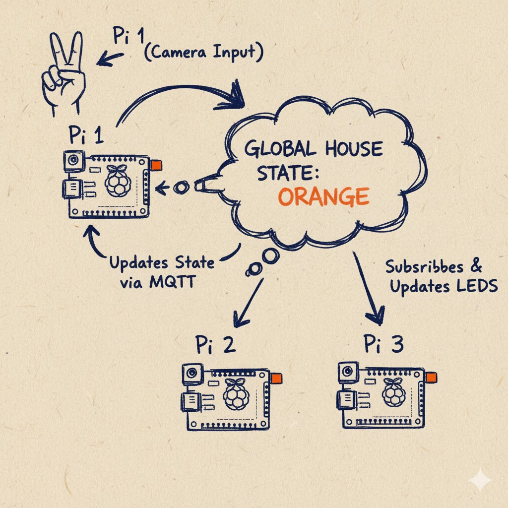
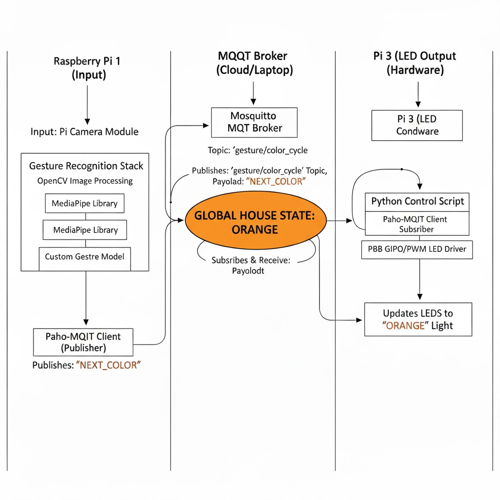

# Distributed Interaction

**Sachin Jojode, Viha Srinivas, and Arya Prasad**

For submission, replace this section with your documentation!

---

## Prep

1. Pull the new changes
2. Read: [The Presence Table](https://dl.acm.org/doi/10.1145/1935701.1935800) ([video](https://vimeo.com/15932020))

## Overview

Build interactive systems where **multiple devices communicate over a network** using MQTT messaging. Work in teams of 3+ with Raspberry Pis.

**Parts:**
- A: Learn MQTT messaging
- B: Try collaborative pixel grid demo  
- C: Build your own distributed system

---

## Part A: MQTT Messaging

**💡 Brainstorm 5 ideas for messaging between devices**

- Talk with Your Hands (Gesture Communicator): Imagine one Pi is watching someone who can't easily talk or hear. When they make a hand sign (like in sign language), the Pi recognizes it and sends a simple message to the others. The other Pis then light up or show text, acting as simple helpers for communication across the house.

- The Three-Part Singing Crew (Harmony Maker): You sing into one Pi, and instantly, the other two Pis act like backup singers. They each take your voice and play it back slightly higher and slightly lower, making it sound like you have a three-person choir. It's a way to use the network to share and process sound in real time.

- House Party Lights (Digital Disco): This turns your Pis into party starters. One Pi listens for loud noises or clapping, and another watches for people dancing or moving around. They quickly tell the third Pi how active things are, and all the lights flash and change colors together, making the atmosphere match the fun.

- "What Do We Need?" Kitchen Checker (Inventory Helper): You point the cameras at different storage spots—like the pantry shelf and the fridge. The Pis quietly watch what's there and what's missing. If you run out of milk or bread, they send you a simple alert, saving you a trip to the store.

- The Three-Eye Watchdog (Distributed Security): You put the three cameras in important spots, like the front door and the backyard. If one camera sees any unexpected movement, it immediately shouts a warning across the network. The third Pi acts as the main alarm box, setting off a big flash on all the lights to let everyone know something is wrong in the house.

---

## Part B: Collaborative Pixel Grid

**📸 Include: Screenshot of grid + photo of your Pi setup**

---

## Part C: Make Your Own

**1. Project Description**
- What does it do? Why interesting? User experience?

We've chosen to build towards our final project by building the gesture controlled modules. The idea is to use cheaper computers (raspberry pi's) to communicate with a larger computer (our laptops) to update a global state in an accessible way. Specifically, we've chosen to encode two gestures akin to ASL that a user can input to change the global consensus between devices. In this case, we've chosen to have two gestures that cycle through colors of the rainbow in different directions. 

**2. Architecture Diagram**
- Hardware, connections, data flow
- Label input/computation/output




**3. Build Documentation**
- Photos of each Pi + sensors
- MQTT topics used
- Code snippets with explanations

**4. User Testing**
- **Test with 2+ people NOT on your team**
- Photos/video of use
- What did they think before trying?
- What surprised them?
- What would they change?

**5. Reflection**
- What worked well?
- Challenges with distributed interaction?
- How did sensor events work?
- What would you improve?

---

## Code Files

**Server files:**
- `app.py` - Pixel grid server (Flask + WebSocket + MQTT)
- `mqtt_viewer.py` - MQTT message viewer for debugging
- `mqtt_bridge.py` - MQTT → WebSocket bridge
- `requirements-server.txt` - Server dependencies

**Pi files:**
- `pixel_grid_publisher.py` - Example (RGB sensor → MQTT)
- `requirements-pi.txt` - Pi dependencies

**Web interface:**
- `templates/grid.html` - Pixel grid display
- `templates/controller.html` - Color picker
- `templates/mqtt_viewer.html` - Message viewer

---

## Debugging Tools

**MQTT Message Viewer:** `http://farlab.infosci.cornell.edu:5001`
- See all MQTT messages in real-time
- View topics and payloads
- Helpful for debugging your own projects

**Command line:**
```bash
# See all IDD messages
mosquitto_sub -h farlab.infosci.cornell.edu -p 1883 -t "IDD/#" -u idd -P "device@theFarm"
```

---

## Troubleshooting

**MQTT:** Broker `farlab.infosci.cornell.edu:1883`, user `idd`, pass `device@theFarm`

**Sensor:** Check `i2cdetect -y 1`, APDS-9960 at `0x39`

**Grid:** Verify server running, check MQTT in console, test with web controller

**Pi venv:** Make sure to activate: `source .venv/bin/activate`


---

## Submission Checklist

Before submitting:
- [ ] Delete prep/instructions above
- [ ] Add YOUR project documentation
- [ ] Include photos/videos/diagrams  
- [ ] Document user testing with non-team members
- [ ] Add reflection on learnings
- [ ] List team names at top

**Your README = story of what YOU built!**

---

Resources: [MQTT Guide](https://www.hivemq.com/mqtt-essentials/) | [Paho Python](https://www.eclipse.org/paho/index.php?page=clients/python/docs/index.php) | [Flask-SocketIO](https://flask-socketio.readthedocs.io/)
